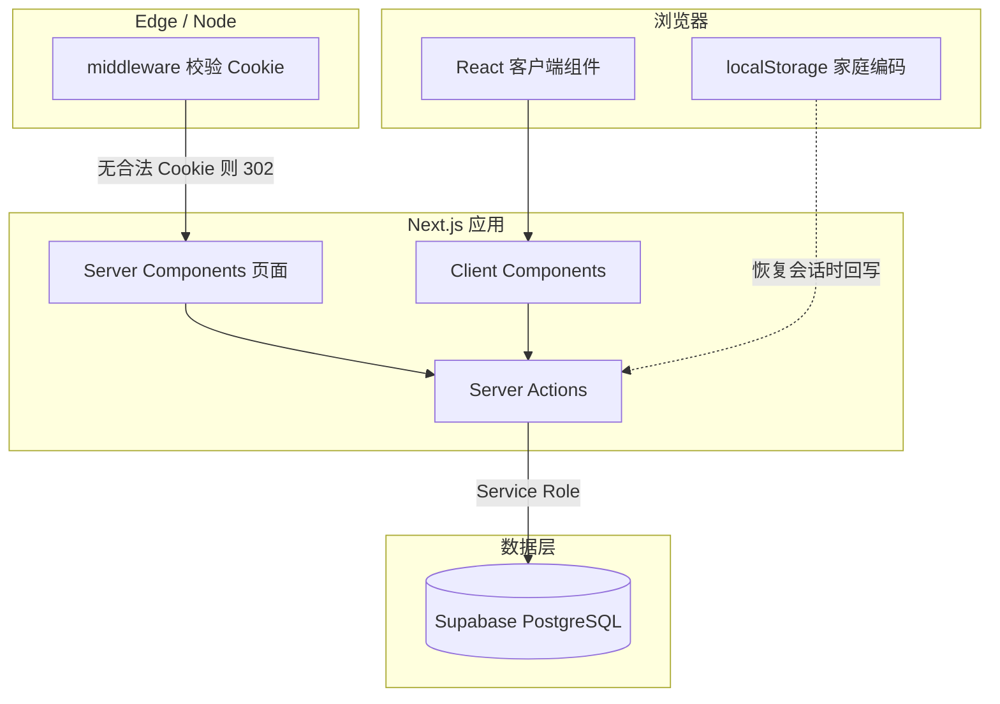

# 系统架构说明

> 项目：家庭记账 · 更新日期：2026-04-08（含小布助手 / Mistral）  
> 本文描述**当前实现**的技术架构、数据流与安全边界；细节契约见 [api.md](./api.md)，表结构见 [database-design.md](./database-design.md)，缓存见 [cache-design.md](./cache-design.md)。

## 1. 架构总览

本应用为 **Next.js 16 App Router** 驱动的**移动端优先**单页式多路由产品：以 **服务端为信任边界** 访问数据库，浏览器通过 **Server Actions** 与 **RSC 首屏数据** 与后端交互；**不使用**浏览器直连 Supabase 业务读、**不使用** Realtime 推送。

| 层级 | 职责 |
|------|------|
| **middleware** | 业务路由需合法 **6 位数字** 家庭编码 Cookie，否则重定向 `/login` |
| **RSC（`app/*/page.tsx`）** | 在服务端读 Cookie、调用 `fetchMembers` / `fetchTransactions` 等，将序列化结果下发给客户端 |
| **Server Actions** | 鉴权（按 Cookie 解析 `household_id`）、写库、失效缓存与路由 |
| **Client Components** | 交互 UI（记账表单、仪表盘列表、统计图表门闸、滑动行、弹窗、**小布浮动对话**等）；通过 Actions 或首屏 props 拿数据 |

## 2. 技术栈

| 类别 | 选型 |
|------|------|
| 框架 | Next.js 16（App Router）、React 19、TypeScript |
| 样式 | Tailwind CSS 4 |
| 数据库 | Supabase（PostgreSQL） |
| 服务端访问 DB | **仅** Service Role（`lib/supabase/service.ts`），不经 anon 业务读 |
| 图表 | Recharts（统计页经 **`StatsChartsGate` 客户端 `dynamic` + `ssr: false`** 分包） |
| 动效 | Framer Motion（局部使用） |
| 浮动拖动 | [react-draggable](https://github.com/react-grid-layout/react-draggable)（`DraggableFab`） |
| 外部 LLM | Mistral：`undici`（`lib/llm/mistral-fetch.ts`；`next.config` 中 `serverExternalPackages: ["undici"]`）；OpenRouter：`openai` SDK（`lib/llm/xiaobu-llm.ts`） |
| 日期 | date-fns |

## 3. 渲染模型：服务端与客户端如何分工

### 3.1 为何不是「纯客户端渲染」

- **Service Role 密钥** 只能存在于服务端；若全部 CSR，需改为 **自建 HTTP API** 或 **Supabase anon + RLS**，安全与改造范围大。  
- 当前模式：**敏感逻辑与密钥留在 Server Actions / RSC**，浏览器只拿**已按家庭过滤**的结果。

### 3.2 典型页面路径

1. 用户进入受保护路由 → **middleware** 校验 Cookie。  
2. **RSC** 执行 `getHouseholdCodeFromCookies`（展示用）+ **`fetchMembers` / `fetchTransactions`**（数据）。  
3. 页面将 `members`、`transactions` 等作为 props 传给 **Client Component**（如 `DashboardClient`、`StatsChartsGate`）。  
4. 写操作（记账、改账、删账）由客户端调用 **Server Actions**，服务端再次校验 Cookie → `household_id` → 写库 → **`revalidateTag("ledger")` + `revalidatePath`**。

### 3.3 统计页的特殊处理

- 数据仍在 **服务端** 拉取（与其它 Tab 一致）。  
- **`StatsChartsGate`**（`"use client"`）内使用 **`next/dynamic(..., { ssr: false })`** 加载 **`StatsCharts`**，使 **Recharts** 进入独立 JS 分包，减轻其它路由首包与 Tab 切换成本。  
- **`app/stats/loading.tsx`** 提供该段专用的轻量骨架（另：**`app/loading.tsx`** 为全局路由切换骨架）。

## 4. 多家庭隔离与会话

- **家庭口令**：6 位数字编码，存 **httpOnly Cookie**（`ledger_household_code`）。  
- **服务端解析**：根据编码查 `households` 得 `household_id`；所有账本读写均带 **`household_id` 条件**，且 **不接受** 客户端传入的 `household_id` 作为信任来源。  
- **localStorage**：仅存编码，用于 Cookie 丢失时由客户端引导再次 `setHouseholdSession`，**不存流水明细**。

详见 [api.md §1](./api.md)、[database-design.md](./database-design.md)。

## 5. 数据访问与缓存（摘要）

- **读**：`fetchMembers`、`fetchTransactions` 使用 **`unstable_cache`**，标签 **`ledger`**；`requireHouseholdId` 使用 React **`cache()`** 在同一 RSC 请求内去重。  
- **写**：`createTransaction` / `updateTransaction` / `deleteTransaction` 及会话类 Action 调用 **`revalidateTag("ledger", "max")`** 与 **`revalidatePath`**。  
- **无** 客户端定时轮询；**无** Redis 等外部 KV。

完整策略见 [cache-design.md](./cache-design.md)。

## 6. 路由与文件映射（逻辑）

| 路径 | 服务端 | 客户端侧重 |
|------|--------|------------|
| `/login` | 登录/创建家、写 Cookie | `EnterHouseholdCode` |
| `/` | 并行拉成员+流水 | `DashboardClient`（左滑编辑/删除、编辑弹窗） |
| `/record` | 拉成员 | `RecordForm`（`datetime-local` 传 `occurredAt`） |
| `/stats` | 拉成员+流水 | `StatsChartsGate` → 动态 `StatsCharts` |
| `/members` | 拉成员+流水 | 成员列表与简短明细；`/members/[memberId]` 为该成员全部账单（分页 + 触底加载，`MemberLedgerClient`） |

全局 **`MobileShell`**（`app/layout.tsx`）在**非** `/login` 路由展示底部导航，并挂载 **`FloatingChatBot`**（可拖动入口 + 对话 Portal）。

## 7. 小布助手（LLM 对话）

- **入口**：`components/features/chat`（`FloatingChatBot.tsx`）编排状态与 Server Actions；`trigger/ChatFabTrigger`（`DraggableFab` + `mascot/ChatBotMascot`）、`panel/FloatingChatPanel`（Portal、消息列表、快捷「本月 / 本年小结」、标题栏 **播报** 开关与 **暂停/继续**）等子目录组件。  
- **服务端**：`mistralLedgerChatAction`（主对话，JSON 槽位 + 可 `createTransaction`）、`mistralChatAction` / `generateMonthlySummaryAction` / `generateYearlySummaryAction`（`app/actions/mistral-chat.ts`）经 **`lib/llm/xiaobu-llm.ts`** 的 **`xiaobuChatCompletion`** 委托 **`lib/foundation/llm`**（默认 **`MistralThenOpenRouterLlmClient`**；独立实现 **`MistralLlmClient`** / **`OpenRouterLlmClient`**），`mistral-fetch` 仍为 Mistral 底层 HTTP；结构化记账契约见 **`lib/llm/chat-ledger.ts`**。  
- **客户端播报**：**`lib/foundation/tts`**（**`createTtsEngine`**、`WebSpeechSynthesisTts` / **`NoopTtsEngine`**，`NEXT_PUBLIC_TTS_PROVIDER`），由 **`useChatAssistantTts`** 持有引擎实例。  
- **客户端语音识别（ASR）**：**`lib/foundation/asr`**（**`createAsrEngine`**、`WebSpeechRecognitionAsrEngine` / **`NoopAsrEngine`**，`NEXT_PUBLIC_ASR_PROVIDER`），由 **`ChatVoiceInputProvider`** 持有引擎实例。  
- **每轮 DB 快照**：`mistralLedgerChatAction` 经 **`fetchLedgerSnapshotData`**（绕过列表 **`unstable_cache`**）拉流水与成员，用 **`computeMonthlyLedgerDigest`** 生成本月文本，并**拼在当前 user 消息顶部**（模型优先读最近 user）；统计类回答以该快照为准，不把 `chat_messages` 历史里的旧数字当真。  
- **密钥**：**`MISTRAL_API_KEY`** 与 **`OPEN_ROUTER_API_KEY`** 至少其一（同配时 Mistral 优先）；及可选模型名、代理、OpenRouter 头，**永不**下发浏览器。  
- **错误契约**：返回 **`MistralTextResult`**（`{ ok: true, data } | { ok: false, error }`），避免预期失败 **`throw`** 触发 Next Server Action 整页 **500**。  
- **本月 / 本年小结**：`generateMonthlySummaryAction` / `generateYearlySummaryAction`；摘要分别由 **`buildMonthlyLedgerDigest`**、**`buildYearlyLedgerDigest`**（**`compute*`** 在 **`lib/ledger/monthly-digest.ts`**）与统计页一致按 **`occurred_at`** 过滤自然月 / 自然年，并含成员与分类维度；浮层底栏两枚快捷按钮，用户句见 **`summary-shortcuts.ts`**。

## 8. 安全边界（必读）

| 项 | 说明 |
|----|------|
| Service Role | **仅服务端**；勿以 `NEXT_PUBLIC_` 暴露 |
| 家庭编码 | 等同**家庭口令**；泄露则他人可会话进入该家庭数据（在现有模型下） |
| RLS | 业务表 **无 anon 读策略**；依赖「仅服务端持 Service Role」 |
| Mistral / OpenRouter Key | 仅存部署环境 / `.env.local`；勿提交 Git |

## 9. 相关文档索引

| 文档 | 内容 |
|------|------|
| [development-guide.md](./development-guide.md) | 目录树、环境、命令、FAQ |
| [lib/foundation/README.md](../lib/foundation/README.md) | 可插拔 LLM / TTS 分层与边界 |
| [api.md](./api.md) | Server Actions 契约 |
| [cache-design.md](./cache-design.md) | 缓存与失效 |
| [database-design.md](./database-design.md) | 表与 RLS |
| [deployment.md](./deployment.md) | 部署与环境变量 |
| [PRD.md](./PRD.md) | 产品需求 |

## 10. 变更记录

| 日期 | 说明 |
|------|------|
| 2026-04-08 | 初版：RSC/CSR 分工、多家庭、缓存摘要、统计分包、安全边界 |
| 2026-04-08 | 小布助手：Mistral Actions、`mistral-fetch`、FloatingChatBot / DraggableFab、技术栈补充 |
| 2026-04-08 | `lib/llm/xiaobu-llm`：Mistral 失败回退 OpenRouter；`openai` 依赖 |
| 2026-04-08 | `lib/` 分层：`ledger/`、`household/`、`llm/`、`supabase/` |
