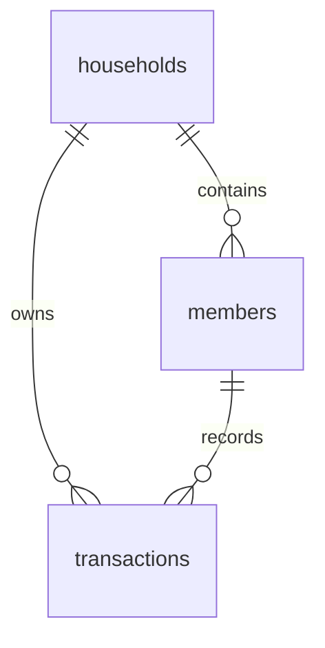

# 数据库设计文档

> 项目：家庭记账 · 载体：Supabase（PostgreSQL） · 更新日期：2026-04-02

## 1. 概述

- **数据库类型**：PostgreSQL（由 Supabase 托管）。
- **环境**：开发 / 生产共用同一套逻辑；通过不同 Supabase 项目或同一项目区分环境（自行约定）。
- **设计原则**：单家庭 MVP 固定 `household_id`（与种子 UUID 及 `NEXT_PUBLIC_HOUSEHOLD_ID` 一致）；流水不设软删（删除为物理删除）；分类暂存在应用层常量，未建维度表。

权威 DDL 以仓库 [`supabase/migrations/001_init.sql`](../supabase/migrations/001_init.sql) 为准。

## 2. ER 关系

## 3. 表结构说明

### 3.1 `households`

| 字段 | 类型 | 约束 | 说明 |
|------|------|------|------|
| id | uuid | PK | 种子默认 `a0000000-0000-4000-8000-000000000001` |
| name | text | NOT NULL | 家庭名称 |
| created_at | timestamptz | NOT NULL, default now() | 创建时间 |

### 3.2 `members`

| 字段 | 类型 | 约束 | 说明 |
|------|------|------|------|
| id | uuid | PK | 种子：布布、一二各固定 UUID |
| household_id | uuid | FK → households.id, ON DELETE CASCADE | 所属家庭 |
| name | text | NOT NULL | 展示名 |
| avatar_url | text | 可空 | 预留头像 URL；当前 UI 用首字渐变 |
| sort_order | int | NOT NULL, default 0 | 排序 |
| created_at | timestamptz | NOT NULL, default now() | 创建时间 |

### 3.3 `transactions`

| 字段 | 类型 | 约束 | 说明 |
|------|------|------|------|
| id | uuid | PK, default gen_random_uuid() | 流水 ID |
| household_id | uuid | FK → households.id, ON DELETE CASCADE | 家庭 |
| member_id | uuid | FK → members.id, ON DELETE RESTRICT | 记账人 |
| type | text | CHECK ∈ (`income`,`expense`) | 收入 / 支出 |
| category | text | NOT NULL | 分类（与前端常量一致） |
| amount | numeric(14,2) | NOT NULL, CHECK > 0 | 金额，恒正 |
| note | text | 可空 | 备注 |
| occurred_at | timestamptz | NOT NULL, default now() | 业务发生时间 |
| created_at | timestamptz | NOT NULL, default now() | 写入时间 |

**索引**

| 索引名 | 字段 | 用途 |
|--------|------|------|
| idx_transactions_household_occurred | (household_id, occurred_at DESC) | 按家庭拉取时间序流水 |

## 4. 行级安全（RLS）

| 表 | anon 策略 | 说明 |
|----|-----------|------|
| households | SELECT，且 `id = 种子家庭 UUID` | 供客户端/Realtime 必要元数据 |
| members | SELECT，且 `household_id = 种子家庭` | 成员列表只读 |
| transactions | SELECT，且 `household_id = 种子家庭` | 列表与 Realtime |

**匿名角色无 INSERT/UPDATE/DELETE**。应用写入使用 **Service Role**（服务端），绕过 RLS。

若将应用对公网开放，建议后续改为登录用户 + 按用户绑定 `household_id` 的策略，并收回过宽的 anon 权限。

## 5. 数据字典与枚举

### 5.1 `transactions.type`

| 值 | 含义 |
|----|------|
| income | 收入 |
| expense | 支出 |

### 5.2 分类（应用层，见 `lib/categories.ts`）

**支出**：餐饮、购物、交通、教育、医疗、娱乐、其他。  
**收入**：工资、奖金、投资、红包、其他。

## 6. 迁移与版本

- **方式**：在 Supabase SQL Editor 手动执行 `001_init.sql`（或复制进 Migration 流水线）。
- **变更记录**：结构性变更建议新增 `002_xxx.sql` 并在 [change/](./change/) 登记迭代说明。

## 7. 备份与恢复

由 **Supabase 项目设置** 中的备份策略决定（按套餐）。生产环境建议在控制台确认 PITR / 自动备份是否开启。
