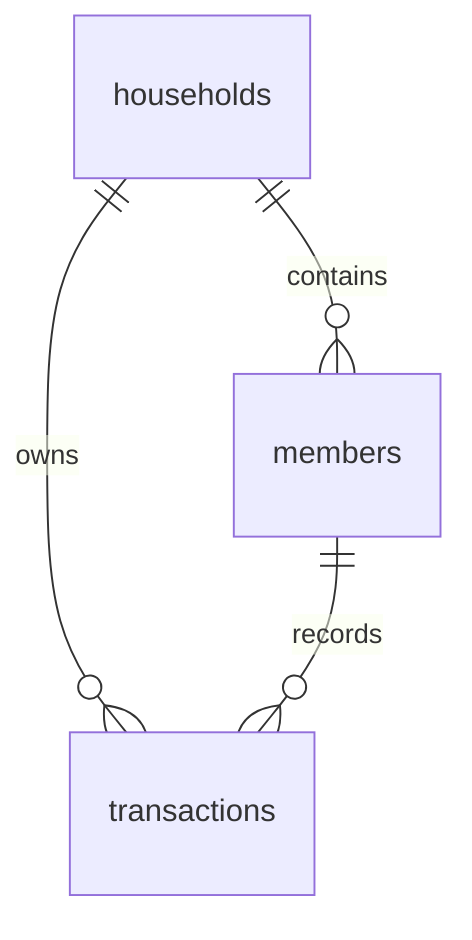

# 数据库设计文档

> 项目：家庭记账 · 载体：Supabase（PostgreSQL） · 更新日期：2026-04-02

## 1. 概述

- **数据库类型**：PostgreSQL（由 Supabase 托管）。
- **多租户**：以 `households` 为租户边界；应用通过 **6 位数字 `code`（唯一）** 解析 `household_id`，会话见 [api.md](./api.md) 与根目录 `README.md`。
- **设计原则**：流水不设软删（删除为物理删除）；收支分类为应用层常量，未建维度表；新建家庭默认成员「布布」「一二」由应用逻辑插入。

权威 DDL 以仓库 [`supabase/migrations/001_init.sql`](../supabase/migrations/001_init.sql) 为准。自旧库升级可执行 [`002_household_code_multitenant.sql`](../supabase/migrations/002_household_code_multitenant.sql)。

## 2. ER 关系

## 3. 表结构说明

### 3.1 `households`

| 字段 | 类型 | 约束 | 说明 |
|------|------|------|------|
| id | uuid | PK | 应用创建新家时由服务端生成；种子数据可为固定 UUID |
| name | text | NOT NULL | 家庭名称 |
| code | text | NOT NULL，UNIQUE，`^[0-9]{6}$` | 登录用 6 位数字家庭编码 |
| created_at | timestamptz | NOT NULL, default now() | 创建时间 |

### 3.2 `members`

| 字段 | 类型 | 约束 | 说明 |
|------|------|------|------|
| id | uuid | PK, default gen_random_uuid() | |
| household_id | uuid | FK → households.id, ON DELETE CASCADE | 所属家庭 |
| name | text | NOT NULL | 展示名（如 布布、一二） |
| avatar_url | text | 可空 | 预留；当前 UI 用首字渐变 |
| sort_order | int | NOT NULL, default 0 | 排序 |
| created_at | timestamptz | NOT NULL, default now() | |

### 3.3 `transactions`

| 字段 | 类型 | 约束 | 说明 |
|------|------|------|------|
| id | uuid | PK, default gen_random_uuid() | 流水 ID |
| household_id | uuid | FK → households.id, ON DELETE CASCADE | 家庭 |
| member_id | uuid | FK → members.id, ON DELETE RESTRICT | 记账人 |
| type | text | CHECK ∈ (`income`,`expense`) | 收入 / 支出 |
| category | text | NOT NULL | 与前端分类常量一致 |
| amount | numeric(14,2) | NOT NULL, CHECK > 0 | 金额 |
| note | text | 可空 | 备注 |
| occurred_at | timestamptz | NOT NULL, default now() | 业务发生时间 |
| created_at | timestamptz | NOT NULL, default now() | 写入时间 |

**索引**

| 索引名 | 字段 | 用途 |
|--------|------|------|
| idx_transactions_household_occurred | (household_id, occurred_at DESC) | 按家庭时间序拉取 |
| households_code_unique | (code) UNIQUE | 家庭编码唯一 |

## 4. 行级安全（RLS）

三表均 **ENABLE ROW LEVEL SECURITY**，且 **不配置面向 `anon` 的 SELECT/写入策略**。

- 业务读写一律经 Next.js **Server Actions**，使用 **Service Role**（绕过 RLS）。  
- 浏览器 **不** 使用 Supabase 匿名客户端访问业务表；多家庭下无法安全做「按编码动态」的 anon Realtime，故已弃用 Realtime 推送。

若后续引入「用户登录 + JWT」，可新增基于 `auth.uid()` 与 `household_members` 映射的 RLS 策略，并逐步收紧 Service Role 使用范围。

## 5. 数据字典与枚举

### 5.1 `transactions.type`

| 值 | 含义 |
|----|------|
| income | 收入 |
| expense | 支出 |

### 5.2 分类（应用层 `lib/categories.ts`）

**支出**：餐饮、购物、交通、教育、医疗、娱乐、其他。  
**收入**：工资、奖金、投资、红包、其他。

## 6. 迁移与版本

- **新库**：执行 `001_init.sql`（含示例家庭 `000001`、`000002`）。  
- **旧库（无 code / 仍有 anon 策略）**：执行 `002_household_code_multitenant.sql`，并确保无重复 `code` 后再 `NOT NULL`。  
- 结构性变更建议在 [change/](./change/) 登记。

## 7. 备份与恢复

由 Supabase 项目备份策略决定；生产建议确认自动备份 / PITR。
