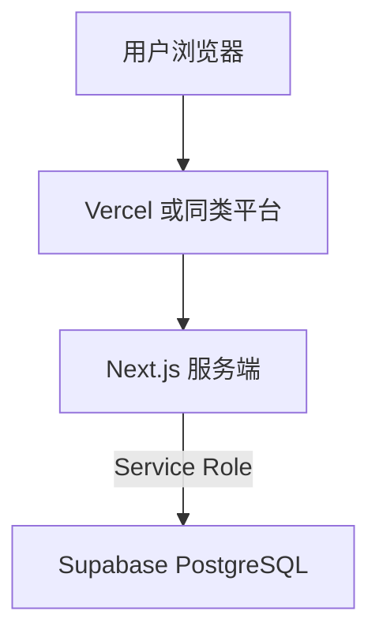

# 部署文档

> 项目：家庭记账（Next.js + Supabase） · 更新日期：2026-04-08

## 1. 部署架构

- **应用**：Next.js（SSR、Server Actions、**middleware** 会话校验）。  
- **数据**：Supabase PostgreSQL；迁移在控制台执行，不随前端构建发布。

## 2. 环境说明

| 环境 | 用途 | 说明 |
|------|------|------|
| 本地 | 开发 | `.env.local` |
| 生产 | 对外 | 平台环境变量 + 建议独立 Supabase 项目 |

## 3. 配置与密钥（环境变量）

| 变量 | 必填 | 说明 |
|------|------|------|
| `NEXT_PUBLIC_SUPABASE_URL` | 是 | Supabase 项目 URL |
| `SUPABASE_SERVICE_ROLE_KEY` | 是 | **仅服务端**；**禁止** `NEXT_PUBLIC_` 前缀 |
| `NEXT_PUBLIC_SUPABASE_ANON_KEY` | 否 | 当前版本业务链路径未使用；预留扩展 |
| `MISTRAL_API_KEY` | 使用小布时 **必填** | **仅服务端**；对话与本月小结 |
| `MISTRAL_MODEL` | 否 | 默认 `mistral-small-latest` |
| `MISTRAL_FETCH_TIMEOUT_MS` | 否 | 默认 `120000`（毫秒） |
| `MISTRAL_PROXY_URL` | 否 | 仅 Mistral 请求走代理时；优先于 `HTTPS_PROXY` |
| `HTTPS_PROXY` / `HTTP_PROXY` 等 | 否 | Node 访问外网需代理时（与 Clash 等 HTTP 端口一致） |

**密钥管理**：Service Role、Mistral Key 仅存部署平台密钥区；勿提交 Git。详见根目录 [.env.example](../.env.example)。

**说明**：已移除对 `NEXT_PUBLIC_HOUSEHOLD_ID` 的依赖；家庭由 **Cookie 中的编码** 与库表 `households.code` 决定。

## 4. 构建产物

| 命令 | 说明 |
|------|------|
| `npm run build` | 生产构建 |
| `npm run start` | 本地验证产物 |

## 5. 部署步骤（以 Vercel 为例）

### 5.1 首次部署

1. Supabase 执行 `001_init.sql`（及按需 `002_*.sql`）。  
2. **无需**为 Realtime 开启 `transactions`（当前未使用）。  
3. 连接 Git，Framework 选 Next.js，配置 §3 变量后 Deploy。  
4. 访问站点应跳转 `/login`；用种子编码 `000001` 或自建家庭验证全流程。

### 5.2 常规发布

推送生产分支触发构建即可。

### 5.3 回滚

在平台将上一稳定 Deployment 提升为 Production。

## 6. 数据库与迁移

- 生产变更前先于 staging / 副本验证 SQL。  
- 多家庭、编码相关见 [database-design.md](./database-design.md)。

## 7. 健康检查与监控

- 依赖平台与 Supabase 控制台；可配日志与告警。

## 8. 灾备

- 数据库按 Supabase 套餐备份；应用无状态，会话在客户端 Cookie，恢复后用户需重新登录编码（localStorage 可减轻影响）。

## 9. 公开部署注意

- 登录页 **创建新家** 对全网开放，存在刷库风险；生产可配合 WAF、速率限制或产品层关闭创建入口。
