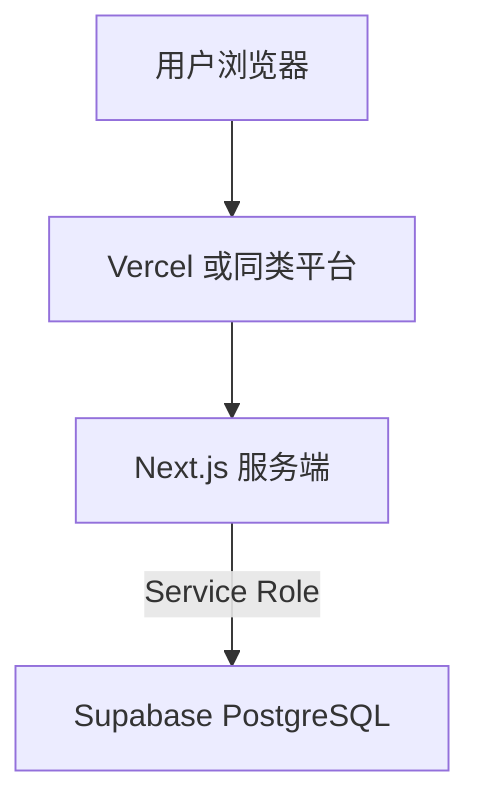

# 部署文档

> 项目：家庭记账（Next.js + Supabase） · 更新日期：2026-04-08

## 1. 部署架构

- **应用**：Next.js（SSR、Server Actions、**middleware** 会话校验）。  
- **数据**：Supabase PostgreSQL；迁移在控制台执行，不随前端构建发布。

## 2. 环境说明

| 环境 | 用途 | 说明 |
|------|------|------|
| 本地 | 开发 | `.env.local` |
| 生产 | 对外 | 平台环境变量 + 建议独立 Supabase 项目 |

## 3. 配置与密钥（环境变量）

| 变量 | 必填 | 说明 |
|------|------|------|
| `NEXT_PUBLIC_SUPABASE_URL` | 是 | Supabase 项目 URL |
| `SUPABASE_SERVICE_ROLE_KEY` | 是 | **仅服务端**；**禁止** `NEXT_PUBLIC_` 前缀 |
| `NEXT_PUBLIC_SUPABASE_ANON_KEY` | 否 | 当前版本业务链路径未使用；预留扩展 |
| `MISTRAL_API_KEY` | 使用小布时与 `OPEN_ROUTER_API_KEY` **至少其一** | **仅服务端**；与 OpenRouter 同配时 **优先 Mistral**，失败则自动切备用 |
| `MISTRAL_MODEL` | 否 | 默认 `mistral-small-latest` |
| `MISTRAL_FETCH_TIMEOUT_MS` | 否 | 默认 `120000`（毫秒） |
| `MISTRAL_PROXY_URL` | 否 | 仅 Mistral 请求走代理时；优先于 `HTTPS_PROXY` |
| `OPEN_ROUTER_API_KEY` | 同上「至少其一」 | **仅服务端**；OpenRouter（`https://openrouter.ai/api/v1`）；作 Mistral 失败时的备用 |
| `OPEN_ROUTER_MODEL` | 否 | 默认 `deepseek/deepseek-chat:free` |
| `OPEN_ROUTER_HTTP_REFERER` | 否 | 可选；OpenRouter 统计用 `HTTP-Referer` |
| `OPEN_ROUTER_APP_TITLE` | 否 | 可选；默认 `record-xiaobu`（对应 `X-Title`）。**须 ASCII/Latin-1**，不可填中文（HTTP 头 ByteString 限制）。 |
| `XIAOBU_LLM_PROVIDER` | 否 | 设为 **`openrouter`** 时强制只用 OpenRouter、不请求 Mistral（仅调试）；须已配 `OPEN_ROUTER_API_KEY` |
| `NEXT_PUBLIC_TTS_PROVIDER` | 否 | 小布播报：`web-speech`（默认）或 **`noop`**（关闭合成能力）；见 **`lib/foundation/tts/factory.client.ts`** |
| `NEXT_PUBLIC_ASR_PROVIDER` | 否 | 小布语音输入：`web-speech`（默认）或 **`noop`**；见 **`lib/foundation/asr/factory.client.ts`** |
| `HTTPS_PROXY` / `HTTP_PROXY` 等 | 否 | Node 访问外网需代理时（与 Clash 等 HTTP 端口一致） |

**密钥管理**：Service Role、Mistral / OpenRouter Key 仅存部署平台密钥区；勿提交 Git。详见根目录 [.env.example](../.env.example)。

**说明**：已移除对 `NEXT_PUBLIC_HOUSEHOLD_ID` 的依赖；家庭由 **Cookie 中的编码** 与库表 `households.code` 决定。

## 4. 构建产物

| 命令 | 说明 |
|------|------|
| `npm run build` | 生产构建 |
| `npm run start` | 本地验证产物 |

## 5. 部署步骤（以 Vercel 为例）

### 5.1 首次部署

1. Supabase 执行 `001_init.sql`（及按需 `002_*.sql`）。  
2. **无需**为 Realtime 开启 `transactions`（当前未使用）。  
3. 连接 Git，Framework 选 Next.js，配置 §3 变量后 Deploy。  
4. 访问站点应跳转 `/login`；用种子编码 `000001` 或自建家庭验证全流程。

### 5.2 常规发布

推送生产分支触发构建即可。

### 5.3 回滚

在平台将上一稳定 Deployment 提升为 Production。

## 6. 数据库与迁移

- 生产变更前先于 staging / 副本验证 SQL。  
- 多家庭、编码相关见 [database-design.md](./database-design.md)。

## 7. 健康检查与监控

### 7.1 /api/health 接口

`GET /api/health` 是一个仅供内部调用的轻量健康检查接口，每次调用会向 Supabase 发一条极轻的查询（`SELECT id FROM households LIMIT 1`），用于：
- 验证服务与数据库连通性
- **防止 Supabase 免费项目因 30 天不活跃被暂停**

鉴权：请求头须带 `Authorization: Bearer <HEALTH_CHECK_SECRET>`。  
未配置 `HEALTH_CHECK_SECRET` 时接口返回 503，拒绝所有请求。

| 变量 | 必填 | 说明 |
|------|------|------|
| `HEALTH_CHECK_SECRET` | 是（启用时） | 任意强随机字符串；与 GitHub Actions Secret 同名同值 |

### 7.2 GitHub Actions 定时保活

`.github/workflows/keep-alive.yml` 在每月 1 日和 21 日（UTC 02:00）自动调用 `/api/health`，确保 30 天内至少有 2 次数据库访问。

**配置步骤：**

1. 在 GitHub 仓库 → Settings → Secrets and variables → Actions 中新增两个 Secret：

   | Secret 名称 | 值 |
   |-------------|-----|
   | `HEALTH_CHECK_URL` | `https://你的域名/api/health` |
   | `HEALTH_CHECK_SECRET` | 与部署平台 `HEALTH_CHECK_SECRET` 环境变量相同的值 |

2. 在 Vercel（或其他平台）的环境变量中新增 `HEALTH_CHECK_SECRET`，值与上面保持一致。

3. 可在 GitHub → Actions → Keep Supabase Alive → Run workflow 手动触发一次验证。

## 8. 灾备

- 数据库按 Supabase 套餐备份；应用无状态，会话在客户端 Cookie，恢复后用户需重新登录编码（localStorage 可减轻影响）。

## 9. 公开部署注意

- 登录页 **创建新家** 对全网开放，存在刷库风险；生产可配合 WAF、速率限制或产品层关闭创建入口。
