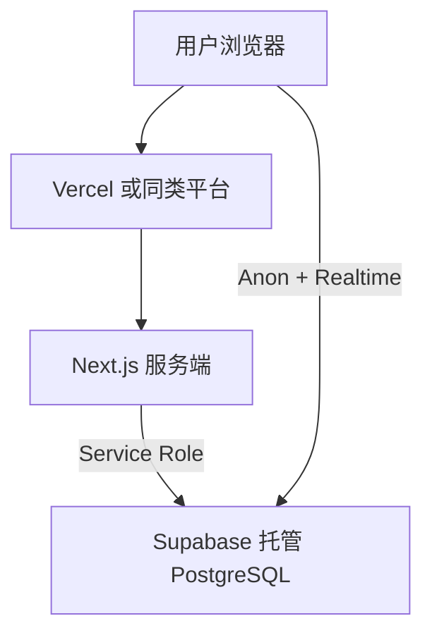

# 部署文档

> 项目：家庭记账（Next.js + Supabase） · 更新日期：2026-04-02

## 1. 部署架构

- **应用**：Next.js 全栈（SSR / Server Actions）。
- **数据**：Supabase（数据库 + Realtime）；**不**随 Next 部署迁移。

## 2. 环境说明

| 环境 | 用途 | 说明 |
|------|------|------|
| 本地 | 开发 | `.env.local`，连接开发用 Supabase 项目（可与生产同项目，慎用） |
| 生产 | 对外使用 | 托管平台环境变量 + 独立 Supabase 生产项目（推荐） |

## 3. 配置与密钥（环境变量）

在部署平台（如 Vercel **Settings → Environment Variables**）配置：

| 变量 | 必填 | 说明 |
|------|------|------|
| `NEXT_PUBLIC_SUPABASE_URL` | 是 | Supabase 项目 URL |
| `NEXT_PUBLIC_SUPABASE_ANON_KEY` | 是 | anon public key |
| `SUPABASE_SERVICE_ROLE_KEY` | 是 | **仅服务端**，勿加 `NEXT_PUBLIC_` |
| `NEXT_PUBLIC_HOUSEHOLD_ID` | 否 | 与数据库种子家庭 UUID 一致；换家庭需同步改库与变量 |

**密钥管理**：生产环境使用平台密钥存储；禁止将 Service Role 提交到 Git 或发给前端。

## 4. 构建产物

| 命令 | 说明 |
|------|------|
| `npm run build` | 生产构建（本地 CI 与线上一致） |
| `npm run start` | 本地验证构建产物 |

输出目录：`.next/`（由平台构建命令自动使用）。

## 5. 部署步骤（以 Vercel 为例）

### 5.1 首次部署

1. 在 Supabase 创建**生产**项目，执行 `supabase/migrations/001_init.sql`，并开启 `transactions` 的 **Realtime**。  
2. 将 Git 仓库连接 Vercel，Framework Preset 选 **Next.js**。  
3. 填入 §3 环境变量，执行 Deploy。  
4. 部署完成后用真实手机访问生产 URL，验证记账与多端同步。

### 5.2 常规发布

1. `main`（或生产分支）推送触发自动构建。  
2. 若仅有文档/SQL 变更不涉及应用代码，按团队流程决定是否跳过构建。

### 5.3 回滚

在 Vercel **Deployments** 中选择上一成功版本 **Promote to Production**。

## 6. 数据库与迁移

- **迁移**：在 Supabase SQL Editor 执行新迁移文件；生产变更前先在**副本或 staging 项目**验证。  
- **可逆性**：删除列/表类迁移需自备回滚脚本；当前 MVP 以向前迁移为主。

## 7. 健康检查与监控

- Next 无单独 `/health`；可通过平台 **Deployment** 状态与 Supabase **Database** 面板观察。  
- 建议开启：Vercel Analytics（可选）、Supabase 项目日志与用量告警。

## 8. 灾备

- 数据库 RPO/RTO 依赖 Supabase 套餐与备份设置。  
- 应用无状态，恢复重点是 **环境变量** 与 **数据库备份**。
