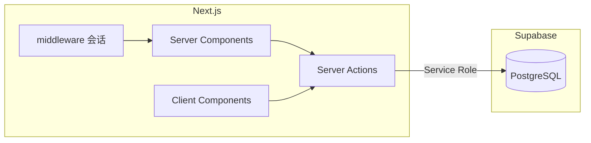

# 开发指南

> 项目：家庭记账（Next.js 移动端 + Supabase） · 更新日期：2026-04-02

## 1. 环境要求

| 工具 | 建议版本 | 说明 |
|------|----------|------|
| Node.js | 20.x / 22.x（与 Next 16 兼容） | |
| 包管理器 | npm（默认） | 亦可用 pnpm / yarn |
| Supabase | 云端项目 | 执行仓库内 SQL 迁移 |

## 2. 技术架构概要



- **会话**：合法 **6 位家庭编码** 存 httpOnly Cookie；`ledger` 与 `household` Server Actions 据此解析 `household_id`。  
- **登录页**：`setHouseholdSession`、`createHouseholdAndLogin`（新建家庭 + 默认成员布布/一二）。  
- **写入流水**：仅 `createTransaction` / `deleteTransaction`；不经浏览器直连 Supabase。  
- **列表刷新**：`DashboardClient` / `StatsCharts` 内 **定时轮询** `fetchTransactions`（无 Realtime）。  
- **布局**：`app/layout.tsx` 中 `max-w-md`；`dynamic = "force-dynamic"`。

详见 [database-design.md](./database-design.md)、[api.md](./api.md)、根目录 [`middleware.ts`](../middleware.ts)。

## 3. 仓库结构

```
/
├── middleware.ts           # 无合法家庭 Cookie 时重定向 /login
├── app/
│   ├── actions/
│   │   ├── household.ts    # 会话、创建新家
│   │   └── ledger.ts       # 账本读写（读 Cookie）
│   ├── login/page.tsx      # 登录 / 创建新家（EnterHouseholdCode）
│   ├── page.tsx            # 仪表盘
│   ├── record/ stats/ members/
│   ├── layout.tsx
│   └── template.tsx
├── components/
│   ├── EnterHouseholdCode.tsx
│   ├── SwitchHouseholdButton.tsx
│   ├── DashboardClient.tsx
│   └── ...
├── lib/
│   ├── household.ts        # 编码规范化、Cookie/Storage 键名
│   ├── household-server.ts # RSC 读 Cookie 编码
│   ├── supabase/service.ts
│   ├── categories.ts
│   ├── aggregates.ts
│   └── types.ts
├── supabase/migrations/
└── docs/
```

## 4. 快速开始

```bash
npm install
cp .env.example .env.local
# 至少配置 NEXT_PUBLIC_SUPABASE_URL、SUPABASE_SERVICE_ROLE_KEY
```

1. Supabase **SQL Editor** 执行 `supabase/migrations/001_init.sql`。  
2. `npm run dev`，打开 http://localhost:3000 → 应进入 `/login`，可用 **`000001`** 加入示例家庭，或 **创建新家**。

## 5. 常用命令

| 命令 | 说明 |
|------|------|
| `npm run dev` | 开发（Turbopack） |
| `npm run build` / `npm run start` | 生产构建与运行 |
| `npm run lint` | ESLint |

## 6. 环境变量

| 变量 | 作用域 | 说明 |
|------|--------|------|
| `NEXT_PUBLIC_SUPABASE_URL` | 服务端 | 项目 URL |
| `SUPABASE_SERVICE_ROLE_KEY` | **仅服务端** | 所有 DB 访问 |
| `NEXT_PUBLIC_SUPABASE_ANON_KEY` | — | 可选；当前主流程未用 |

## 7. 代码与约定

- **TypeScript**、React 19、Next.js 16 App Router、Tailwind 4。  
- **Server Actions**：`app/actions/*.ts`。  
- **Lint**：避免在 `try/catch` 内直接 `return <JSX />`（见历史 eslint 规则）。  
- **金额**：`lib/format.ts` 展示。

## 8. 测试

未接自动化测试；可后续加 Vitest / Playwright。

## 9. 文档索引

| 主题 | 文档 |
|------|------|
| 产品 | [PRD.md](./PRD.md) |
| 库表 / RLS | [database-design.md](./database-design.md) |
| Actions / 会话 | [api.md](./api.md) |
| 缓存与轮询 | [cache-design.md](./cache-design.md) |
| 部署 | [deployment.md](./deployment.md) |
| 迭代 | [change/](./change/) |

## 10. 常见问题（FAQ）

| 问题 | 处理 |
|------|------|
| 一直跳登录 | 检查 Cookie 是否写入；中间件是否校验 6 位数字。 |
| 创建家提示编码已存在 | 换 6 位数字；查表 `households.code`。 |
| 无法连库 | `.env.local`、Supabase 项目状态、Service Role 是否正确。 |
| 另一台设备更新慢 | 属轮询间隔；可调 `DashboardClient` / `StatsCharts` 间隔（权衡流量）。 |
