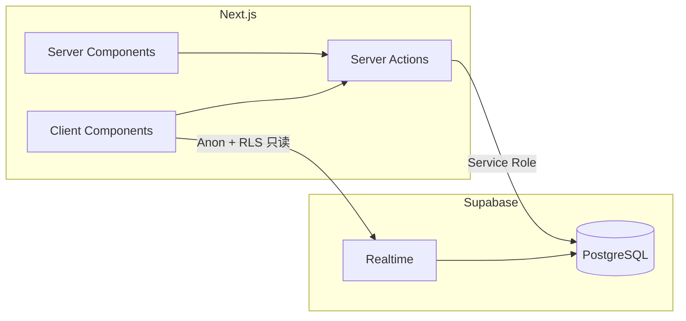

# 开发指南

> 项目：家庭记账（Next.js 移动端 + Supabase） · 更新日期：2026-04-02

## 1. 环境要求

| 工具 | 建议版本 | 说明 |
|------|----------|------|
| Node.js | 20.x / 22.x（与 Next 16 兼容） | 若 ESLint 报 engine 警告，可升级小版本 |
| 包管理器 | npm（仓库默认） | 亦可用 pnpm / yarn |
| Supabase | 云端项目 | 需自行注册并执行迁移 SQL |

## 2. 技术架构概要



- **页面数据**：路由级 Server Component 通过 Server Actions 中的 `fetchMembers` / `fetchTransactions` 拉取首屏数据（使用 **Service Role**，服务端执行）。
- **写入**：仅 `createTransaction` / `deleteTransaction`（Server Actions），不经由浏览器直连写库。
- **实时刷新**：仪表盘等客户端组件用 **Anon Key** 订阅 `transactions` 表的 `postgres_changes`，收到变更后再次调用 `fetchTransactions` 刷新列表；写入仍走 Server Actions。
- **布局**：`app/layout.tsx` 中 `max-w-md` 模拟移动端；`export const dynamic = "force-dynamic"` 避免账本数据被静态缓存成旧数据。

更细的库表与 RLS 见 [database-design.md](./database-design.md)；「接口」形态见 [api.md](./api.md)。

## 3. 仓库结构

```
/
├── app/                    # App Router
│   ├── actions/ledger.ts   # Server Actions（账本读写）
│   ├── page.tsx            # 首页仪表盘
│   ├── record/page.tsx     # 记账
│   ├── stats/page.tsx      # 图表统计
│   ├── members/page.tsx    # 成员与明细
│   ├── layout.tsx          # 根布局、MobileShell
│   └── template.tsx        # 页面过渡动画
├── components/             # UI 组件（DashboardClient、RecordForm 等）
├── lib/
│   ├── supabase/           # service（服务端）/ browser（客户端）
│   ├── categories.ts       # 收支分类常量（非 DB）
│   ├── aggregates.ts       # 汇总与图表聚合
│   ├── constants.ts        # HOUSEHOLD_ID
│   └── types.ts
├── supabase/migrations/    # SQL 迁移（需在 Supabase 控制台执行）
├── docs/                   # 项目文档
└── README.md               # 快速上手（与环境变量）
```

## 4. 快速开始

```bash
npm install
cp .env.example .env.local
# 编辑 .env.local：填入 Supabase URL、Anon Key、Service Role Key 等
```

1. 在 Supabase **SQL Editor** 执行 `supabase/migrations/001_init.sql`。  
2. 在控制台为表 **`transactions`** 开启 **Realtime**（Replication / Publication）。  
3. 本地启动：

```bash
npm run dev
```

浏览器访问 http://localhost:3000 ，建议使用开发者工具移动设备尺寸或真机局域网调试。

## 5. 常用命令

| 命令 | 说明 |
|------|------|
| `npm run dev` | 开发服务器（Turbopack） |
| `npm run build` | 生产构建 |
| `npm run start` | 启动生产构建产物 |
| `npm run lint` | ESLint（含 React Compiler 相关规则） |

## 6. 环境变量

| 变量 | 作用域 | 说明 |
|------|--------|------|
| `NEXT_PUBLIC_SUPABASE_URL` | 客户端 + 服务端 | Supabase 项目 URL |
| `NEXT_PUBLIC_SUPABASE_ANON_KEY` | 客户端 + 服务端 | 匿名密钥；Realtime 与 RLS 只读 |
| `SUPABASE_SERVICE_ROLE_KEY` | **仅服务端** | 写入/删除流水；**禁止** `NEXT_PUBLIC_` |
| `NEXT_PUBLIC_HOUSEHOLD_ID` | 客户端 + 服务端 | 默认与迁移种子家庭 UUID 一致 |

获取 **Service Role Key**：Supabase Dashboard → **Project Settings → API** → **service_role** → Reveal / 复制。详见根目录 `README.md` 安全说明。

## 7. 代码与约定

- **语言与框架**：TypeScript、React 19、Next.js 16 App Router、Tailwind CSS 4。
- **Server Actions**：`app/actions/ledger.ts`；抛错会被页面捕获并展示 `SetupPrompt`（配置错误时）。
- **Lint**：避免在 `try/catch` 内直接 `return <Component />`（eslint react-hooks/error-boundaries）；数据获取在 `try` 内完成，`return JSX` 放在 `try` 外。
- **金额**：数据库存 `numeric`；应用内用 `number`；展示用 `lib/format.ts` 的 `formatMoney`。
- **分类**：`lib/categories.ts` 常量；若改为可配置，需同步改 UI 与文档。

## 8. 测试

当前版本**未**接入自动化测试。建议后续补充：

- Server Actions 与聚合函数的单元测试（Vitest / Jest）。
- 关键流程的 Playwright 移动端视口 E2E（可选）。

## 9. 与文档的对应关系

| 主题 | 文档 |
|------|------|
| 产品范围与验收 | [PRD.md](./PRD.md) |
| 表结构 / RLS | [database-design.md](./database-design.md) |
| Server Actions / 数据访问 | [api.md](./api.md) |
| 缓存与实时策略 | [cache-design.md](./cache-design.md) |
| 上线与环境 | [deployment.md](./deployment.md) |
| 迭代记录 | [change/](./change/) |

## 10. 常见问题（FAQ）

| 问题 | 处理 |
|------|------|
| 页面提示无法连接数据库 | 检查 `.env.local` 是否齐全；Supabase 项目是否暂停；网络是否可达。 |
| 记账成功但另一台手机不刷新 | 确认 `transactions` 已加入 Realtime Publication；浏览器控制台无订阅错误。 |
| `npm run build` 报类型错误 | 运行 `npm run lint`；确保 `members` 关联查询返回类型与 `normalizeMember` 一致。 |
| RLS 报错 permission denied | 写入必须使用 Service Role（Server Actions）；浏览器仅用 Anon 做 **select** 相关操作。 |
