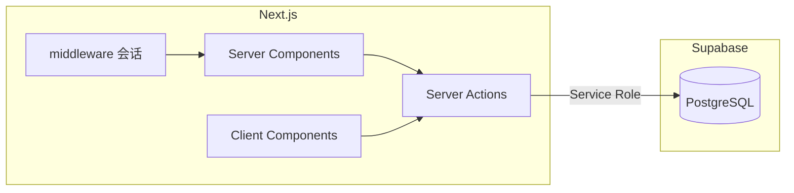

# 开发指南

> 项目：家庭记账（Next.js 移动端 + Supabase） · 更新日期：2026-04-08（含小布助手 / Mistral）

## 1. 环境要求

| 工具 | 建议版本 | 说明 |
|------|----------|------|
| Node.js | 20.x / 22.x（与 Next 16 兼容） | |
| 包管理器 | npm（默认） | 亦可用 pnpm / yarn |
| Supabase | 云端项目 | 执行仓库内 SQL 迁移 |

## 2. 技术架构概要



- **会话**：合法 **6 位家庭编码** 存 httpOnly Cookie；`ledger` 与 `household` Server Actions 据此解析 `household_id`。  
- **登录页**：`setHouseholdSession`、`createHouseholdAndLogin`（新建家庭 + 默认成员布布/一二）。  
- **写入流水**：`createTransaction` / `updateTransaction` / `deleteTransaction`；不经浏览器直连 Supabase。  
- **列表刷新**：无定时轮询；统计页数据由 RSC 拉取后通过 `StatsChartsGate` 注入客户端图表；`DashboardClient` 在删账/改账后调用 `fetchTransactions()` 等更新状态。  
- **读缓存**：`ledger.ts` 中成员与流水列表经 `unstable_cache`（标签 `ledger`）缓存，变更时 `revalidateTag("ledger", "max")`；同一次 RSC 内 `requireHouseholdId` 经 React `cache()` 去重。  
- **布局**：`app/layout.tsx` 中 `max-w-md`；**不再**在根布局声明 `force-dynamic`（业务页因 `cookies()` 等仍为动态渲染）。  
- **Loading**：`app/loading.tsx` 为通用路由骨架；`app/stats/loading.tsx` 仅统计页；统计图表由 `components/features/stats/StatsChartsGate.tsx` 内 `dynamic(..., { ssr: false })` 分包加载 Recharts。
- **小布助手**：`components/common/MobileShell` 挂载 **`components/features/chat`**（`index.ts` 导出 `FloatingChatBot`，`/login` 不显示）；对话（**`mistralLedgerChatAction`**：结构化 JSON、缺槽追问、就绪后服务端 **`createTransaction`**）与「本月小结」走 **`app/actions/mistral-chat.ts`**，契约见 **`lib/llm/chat-ledger.ts`**，历史落库 **`app/actions/chat-history.ts`**（表 **`chat_messages`**，按家庭）；出站 LLM 经 **`lib/llm/xiaobu-llm.ts`**（**`xiaobuChatCompletion`**）：优先 Mistral（**`lib/llm/mistral-fetch.ts`**，undici + 可选代理），失败或未配 Mistral 密钥时可走 **OpenRouter**（`openai` SDK，默认 `deepseek/deepseek-chat:free`）；**密钥仅服务端**，业务错误以 **`MistralTextResult`（ok/error）** 返回，避免 Action `throw` 导致整页 POST 500。浮动入口拖动基于 **[react-draggable](https://github.com/react-grid-layout/react-draggable)**（`components/common/DraggableFab`）；吉祥物为 **`components/features/chat/mascot/ChatBotMascot`**（SVG SMIL 动画）。**助手侧回复**由 **`components/common/MarkdownText`**（**react-markdown**）渲染，用户消息仍为纯文本。**底部输入**在支持 **Web Speech API** 的浏览器中显示麦克风（实现为 `components/features/chat/panel/ChatVoiceInput.tsx`：`ChatVoiceInputProvider`、`ChatVoiceMicButton`、`ChatVoiceStatusLine`）；开始识别前会先调用 **`getUserMedia({ audio: true })`** 触发**麦克风权限**（与语音识别同源权限），拿到流后立即 `stop` 轨道以免占用设备；无 `mediaDevices` 的环境则跳过预检直接走识别。`zh-CN` 识别需 **HTTPS 或 localhost**；**iOS WebKit**、**微信内置页**等仍可能无法授权或报 `service-not-allowed`；**Android Chrome** 多依赖云端识别与网络。触控端使用**非连续**识别。浮层在移动端使用 **`svh` + `max-h-full` + 头尾 `shrink-0`**，保证消息列表在面板内独立滚动且不被底栏遮挡（见 [change/2026-04-08.md](./change/2026-04-08.md) §4）。
- **Next 配置**：`next.config.ts` 中 **`serverExternalPackages: ["undici"]`**，避免 Turbopack 打包 undici 后代理异常。

详见 [database-design.md](./database-design.md)、[api.md](./api.md)、根目录 [`middleware.ts`](../middleware.ts)。

## 3. 仓库结构

```
/
├── middleware.ts           # 无合法家庭 Cookie 时重定向 /login
├── app/
│   ├── actions/
│   │   ├── household.ts    # 会话、创建新家
│   │   ├── ledger.ts       # 账本读写（读 Cookie）；导出 requireHouseholdId
│   │   ├── chat-history.ts # 小布：chat_messages 拉取与落库
│   │   └── mistral-chat.ts # 小布：多轮对话、本月小结（经 xiaobu-llm）
│   ├── login/page.tsx      # 登录 / 创建新家（EnterHouseholdCode）
│   ├── page.tsx            # 仪表盘
│   ├── loading.tsx         # 通用路由切换骨架
│   ├── record/page.tsx
│   ├── stats/
│   │   ├── loading.tsx     # 统计页专用轻量骨架
│   │   └── page.tsx
│   ├── members/
│   │   ├── page.tsx         # 成员列表
│   │   └── [memberId]/page.tsx  # 单成员全部账单（分页 + 触底加载）
│   └── layout.tsx          # MobileShell 包裹主内容
├── components/
│   ├── common/             # 公共 UI：壳层、可复用小块、统计图骨架
│   │   ├── MobileShell.tsx
│   │   ├── DraggableFab.tsx
│   │   ├── MemberAvatar.tsx
│   │   ├── MarkdownText.tsx # react-markdown：小布助手气泡内 Markdown
│   │   └── StatsChartsSkeleton.tsx
│   └── features/           # 按业务域划分的功能组件
│       ├── household/      # 登录、切换家庭、无数据提示
│       ├── members/        # MemberLedgerClient（与首页「最近账单」同款左滑行）
│       ├── record/         # 记账、仪表盘流水、编辑弹窗、左滑行
│       ├── stats/          # StatsCharts + Gate（dynamic 分包）
│       └── chat/           # 小布：按职责分子目录（panel / message / trigger / mascot）
│           ├── index.ts              # 导出 FloatingChatBot
│           ├── types.ts              # ChatUiMessage、newChatMessageId
│           ├── FloatingChatBot.tsx   # 状态与历史；`mistralLedgerChatAction` / 本月小结
│           ├── panel/                # Portal 壳、头/列表/底栏、ChatVoiceInput（Web Speech）
│           ├── message/              # 气泡、空态、思考中、打字点
│           ├── trigger/              # DraggableFab 入口
│           └── mascot/               # ChatBotMascot
├── lib/
│   ├── household/          # 家庭编码：Cookie/Storage 键名与规范化（`index` 客户端可引）；`server.ts` 仅 RSC/Server
│   ├── ledger/             # 账本领域：类型、分类白名单、聚合、统计周期、金额格式
│   ├── llm/                # 小布：`mistral-fetch`、`xiaobu-llm`、`chat-ledger`
│   └── supabase/service.ts # Service Role 客户端
├── supabase/migrations/
└── docs/
```

## 4. 快速开始

```bash
npm install
cp .env.example .env.local
# 至少配置 NEXT_PUBLIC_SUPABASE_URL、SUPABASE_SERVICE_ROLE_KEY
# 使用小布助手时配置 MISTRAL_API_KEY 和/或 OPEN_ROUTER_API_KEY（及可选代理，见 .env.example）
```

1. Supabase **SQL Editor** 执行 `supabase/migrations/001_init.sql`。  
2. `npm run dev`，打开 http://localhost:3000 → 应进入 `/login`，可用 **`000001`** 加入示例家庭，或 **创建新家**。

## 5. 常用命令

| 命令 | 说明 |
|------|------|
| `npm run dev` | 开发（Turbopack） |
| `npm run build` / `npm run start` | 生产构建与运行 |
| `npm run lint` | ESLint |

## 6. 环境变量

| 变量 | 作用域 | 说明 |
|------|--------|------|
| `NEXT_PUBLIC_SUPABASE_URL` | 服务端 | 项目 URL |
| `SUPABASE_SERVICE_ROLE_KEY` | **仅服务端** | 所有 DB 访问 |
| `NEXT_PUBLIC_SUPABASE_ANON_KEY` | — | 可选；当前主流程未用 |
| `MISTRAL_API_KEY` | **仅服务端** | 小布主通道；与 `OPEN_ROUTER_API_KEY` 至少其一；勿 `NEXT_PUBLIC_` |
| `MISTRAL_MODEL` | 服务端 | 可选，默认 `mistral-small-latest` |
| `MISTRAL_FETCH_TIMEOUT_MS` | 服务端 | 可选，默认 `120000` |
| `MISTRAL_PROXY_URL` / `HTTPS_PROXY` 等 | 服务端 | 可选；Node 访问 Mistral 走代理时配置（见 [.env.example](../.env.example)） |
| `OPEN_ROUTER_API_KEY` | **仅服务端** | 小布备用；Mistral 失败时自动使用；单独配置时仅走 OpenRouter |
| `OPEN_ROUTER_MODEL` 等 | 服务端 | 可选；默认 `deepseek/deepseek-chat:free`；Referer/Title 见 deployment |
| `XIAOBU_LLM_PROVIDER` | 服务端 | 可选；设为 **`openrouter`** 时强制仅 OpenRouter（测通后去掉） |

## 7. 代码与约定

- **TypeScript**、React 19、Next.js 16 App Router、Tailwind 4。  
- **Server Actions**：`app/actions/*.ts`。  
- **依赖**：`react-draggable`（浮动按钮拖动）、`undici`（Mistral 上游 fetch）、`openai`（OpenRouter 兼容调用）、`framer-motion`（如输入中动画）。  
- **Lint**：避免在 `try/catch` 内直接 `return <JSX />`（见历史 eslint 规则）。  
- **金额**：`lib/ledger/format.ts` 展示。

## 8. 测试

未接自动化测试；可后续加 Vitest / Playwright。

## 9. 文档索引

| 主题 | 文档 |
|------|------|
| 产品 | [PRD.md](./PRD.md) |
| 系统架构 | [architecture.md](./architecture.md) |
| 库表 / RLS | [database-design.md](./database-design.md) |
| Actions / 会话 | [api.md](./api.md) |
| 缓存与刷新策略 | [cache-design.md](./cache-design.md) |
| 部署 | [deployment.md](./deployment.md) |
| 迭代 | [change/](./change/) |

## 10. 常见问题（FAQ）

| 问题 | 处理 |
|------|------|
| 一直跳登录 | 检查 Cookie 是否写入；中间件是否校验 6 位数字。 |
| 创建家提示编码已存在 | 换 6 位数字；查表 `households.code`。 |
| 无法连库 | `.env.local`、Supabase 项目状态、Service Role 是否正确。 |
| 另一台设备更新不自动出现 | 刷新页面或切换路由；若需近实时可后续接 Realtime 或手动刷新按钮。 |
| Tab 切换仍慢 | 生产环境看 Supabase 区域延迟；已做 `unstable_cache` + 统计页 Recharts 分包；可开 Network 看 RSC 与 JS chunk。 |
| `ssr: false` 报错 | 勿在 Server Component 写 `dynamic(..., { ssr:false })`；统计页用 `StatsChartsGate` 客户端封装。 |
| 小布请求失败 / 终端 `fetch failed` | 检查 `MISTRAL_API_KEY` / `OPEN_ROUTER_API_KEY`、本机网络；Mistral 限流时可配 OpenRouter 作回退；Node 访问 Mistral 需代理时在 `.env.local` 配置 `MISTRAL_PROXY_URL` 或 `HTTPS_PROXY` 后重启 dev。**OpenRouter** 失败时请看运行 `next dev` 的终端：会以 **`[xiaobu-openrouter]`** 打印 `status`、`errorBody`、`requestID` 等（不经 UI 暴露给用户）。 |
| 小布 Action 返回 500 | 业务错误应走 `MistralTextResult`，勿在 Action 内对预期失败 `throw`，否则 RSC POST 易报 500。 |
